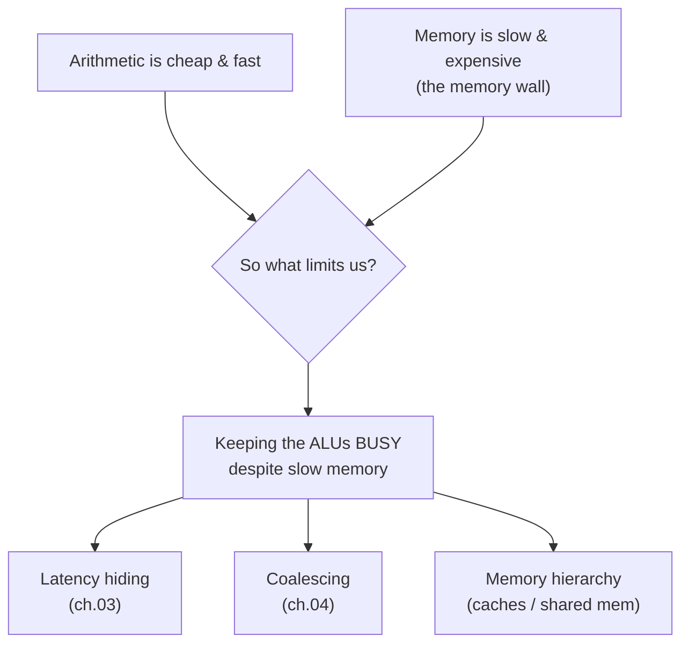

# 01 — Why GPUs Exist

> **Goal:** understand the fundamental design pressure that makes a GPU look nothing like
> a CPU. By the end you should be able to explain, to a smart friend, *why* throughput
> machines exist and what "the memory wall" means.

---

## 1. The problem: two very different wishes

Imagine two jobs.

- **Job A — "answer one question, fast."** A user clicks a button; you must return a
  single answer as quickly as possible. What matters is **latency**: the time from start
  to that one finish.
- **Job B — "answer a billion questions, per second."** You must shade 8 million pixels
  60 times a second, or multiply two 4096×4096 matrices. No single answer matters; what
  matters is **throughput**: total answers per unit time.

These two wishes pull hardware in *opposite* directions, and you cannot fully satisfy both
with one design. This single tension is the root of the entire CPU-vs-GPU story.

```
   LATENCY machine (CPU)                    THROUGHPUT machine (GPU)
   "finish ONE task ASAP"                   "finish the MOST tasks / second"

   ┌───────────────────────────┐           ┌───────────────────────────┐
   │  big control logic         │           │ tiny control, HUGE ALU     │
   │  (branch predictor,        │           │ array                       │
   │   out-of-order scheduler)  │           │ ▓▓▓▓▓▓▓▓▓▓▓▓▓▓▓▓ (lanes)   │
   │  ┌─────┐  large caches     │           │ ▓▓▓▓▓▓▓▓▓▓▓▓▓▓▓▓            │
   │  │ 1-8 │  ▒▒▒▒▒▒▒▒          │           │ ▓▓▓▓▓▓▓▓▓▓▓▓▓▓▓▓            │
   │  │cores│  ▒▒▒▒▒▒▒▒          │           │ ▓▓▓▓▓▓▓▓▓▓▓▓▓▓▓▓            │
   │  └─────┘                    │           │ small caches, big DRAM BW  │
   └───────────────────────────┘           └───────────────────────────┘
   spends transistors making ONE            spends transistors on MANY
   thread finish fast                       arithmetic units running at once
```

A CPU spends most of its silicon *not* on arithmetic — it spends it on machinery to make a
**single** instruction stream finish quickly: branch predictors that guess the future,
out-of-order engines that reorder work, and big caches to avoid slow memory. A GPU makes
the opposite bet: strip the fancy per-thread machinery, and spend the transistors on a
**huge array of simple arithmetic lanes** that do useful math in parallel.

**Analogy.** A CPU is a Formula-1 car: one seat, insanely optimized to get *one* driver
around fast. A GPU is a fleet of school buses: each bus is slower, but you move *vastly*
more passengers per hour. If your job is "move one VIP," take the F1 car. If your job is
"move a stadium," take the buses.

---

## 2. Flynn's taxonomy: naming the four ways to compute

In 1966 Michael Flynn classified machines by how many **instruction streams** and **data
streams** they juggle. It is still the cleanest vocabulary we have.

```
                 one DATA stream            many DATA streams
              ┌────────────────────────┬────────────────────────┐
  one         │  SISD                   │  SIMD                   │
  INSTRUCTION │  a classic scalar CPU   │  one instruction acts   │
  stream      │  (1 op, 1 datum)        │  on many data at once   │
              │                         │  (vector units: AVX)    │
              ├────────────────────────┼────────────────────────┤
  many        │  MISD                   │  MIMD                   │
  INSTRUCTION │  (rare; fault-tolerant  │  many cores each running│
  streams     │   pipelines)            │  their own program      │
              │                         │  (multicore CPU)        │
              └────────────────────────┴────────────────────────┘
```

A GPU is essentially **SIMD taken to an extreme** — but with a crucial twist that makes it
feel like you're writing ordinary threaded code. NVIDIA named that twist **SIMT**
(Single-Instruction, **Multiple-Thread**), and it is the subject of the next chapter. For
now, hold this: *a GPU gets its throughput by applying one instruction to many data
elements simultaneously.*

---

## 3. The memory wall: the villain of this whole story

Here is the most important fact in modern computer architecture, and the one that
motivates almost everything a GPU does.

> **Arithmetic got fast. Memory did not keep up.**

For decades, the number of arithmetic operations a chip can do per second grew far faster
than the rate at which memory can *feed it data*. The gap is now enormous:

```
   Doing the math:   cheap and fast   →  a multiply is ~a few cycles
   Getting the data: slow and costly  →  a DRAM access is HUNDREDS of cycles

   Rough energy cost (illustrative, order-of-magnitude):
     one 32-bit ADD ................... ~1  unit
     read 32 bits from on-chip SRAM ... ~10 units
     read 32 bits from off-chip DRAM .. ~1000+ units   ⚠ the wall
```

The consequence has a name: the **memory wall** (Wulf & McKee, 1995). Processors spend a
huge fraction of their time *waiting* for data, not computing. A modern chip can often do
50–100+ arithmetic operations in the time it takes to fetch one number from DRAM.

This reframes the goal of a throughput machine. It is **not** "do arithmetic fast" — that's
already easy. It is: **keep the arithmetic units busy despite slow memory.** Everything
interesting about GPUs — massive multithreading, latency hiding, coalescing, the memory
hierarchy — is an answer to that one question.



**This is also the thesis of the whole Lithos project.** Arm A (this mini-GPU) will let you
*measure* the wall: you'll see arithmetic-heavy kernels fly and memory-heavy kernels stall.
Arm C then attacks the wall directly by moving compute *into* memory (PIM). The wall is not
a footnote — it's the plot.

---

## 4. What a GPU trades away (there is no free lunch)

The GPU's bet buys throughput but *costs* you in three ways you must respect:

1. **Per-thread latency is bad.** Any single thread on a GPU is slower than on a CPU.
   Throughput machines win only when you have *thousands* of independent tasks.
2. **Control flow is expensive.** Because many threads share one instruction stream, an
   `if` that sends threads down different paths forces the hardware to run both paths — a
   phenomenon called **divergence** (chapter 05). Control-heavy code fits GPUs poorly.
3. **Memory access patterns matter enormously.** Neighboring threads must touch
   neighboring memory to be efficient (**coalescing**, chapter 04). Scattered access can be
   an order of magnitude slower.

> **Reality check.** These three costs are exactly why GPUs are spectacular at dense linear
> algebra and neural networks (regular, arithmetic-heavy, predictable memory) and *poor* at
> irregular, branchy workloads like traversing decision trees. In fact, the earlier phase
> of this very project measured that mismatch and shut down a design that assumed otherwise
> (see `../../spike/out/conclusion.md`). Keep these costs in mind — they are not academic.

---

## 5. Where our mini-GPU fits

Our simulator is deliberately a **throughput machine in miniature**. It has:

- an array of parallel **lanes** grouped into **warps** (chapter 02),
- a scheduler that **hides memory latency** by running many warps (chapter 03),
- a memory model that rewards **coalesced** access (chapter 04),
- and (soon) the machinery for **divergence** (chapter 05).

It does *not* have branch predictors, out-of-order execution, or big caches — because those
are the CPU's answers to a *different* question. By omitting them, the code stays small
enough to read in an afternoon, and the throughput-machine ideas stand out clearly.

---

## Check your understanding
1. In one sentence, what is the difference between optimizing for latency vs throughput?
2. Why doesn't "arithmetic is cheap" mean "computing is fast"?
3. Name the three things a GPU trades away for its throughput, and give a workload that
   suffers from each.

*(Answers are developed across the next chapters; if you can attempt all three now, you've
got the core intuition.)*

---

## References
- J. L. Hennessy & D. A. Patterson, *Computer Architecture: A Quantitative Approach*, 6th
  ed. — Ch. 4 (data-level parallelism, GPUs) and Ch. 2 (memory hierarchy). The standard
  text.
- M. J. Flynn, "Some Computer Organizations and Their Effectiveness," *IEEE Trans.
  Computers*, 1972 (the taxonomy).
- Wm. A. Wulf & S. A. McKee, "Hitting the Memory Wall: Implications of the Obvious," *ACM
  SIGARCH Computer Architecture News*, 1995 (coins "memory wall").
- NVIDIA, *CUDA C++ Programming Guide* — "Hardware Model" and "Performance Guidelines."
- V. Volkov, "Understanding Latency Hiding on GPUs," Ph.D. thesis, UC Berkeley, 2016
  (deep, and central to chapter 03).

→ Next: [02 — The SIMT Execution Model](02-simt-execution-model.md)
