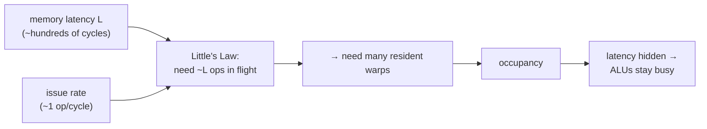

# 03 — Latency Hiding & Occupancy

> **Goal:** understand the GPU's single most important trick — running *far* more threads
> than it has lanes so that, while some threads wait on slow memory, others compute. By the
> end you'll be able to derive our "2 warps cost the same as 1 warp" result and explain why.

---

## 1. The problem: a memory access takes *hundreds* of cycles

Recall the memory wall (chapter 01): fetching a value from DRAM costs on the order of
**hundreds of cycles**, while arithmetic costs ~1. Now watch what happens to a single
thread that needs data from memory:

```
   ONE thread, must load then add:

   cycle:   0        1 ..................... 200      201
            LOAD ───▶ (stall, waiting on DRAM) ───▶  ADD
                     └──────── ~200 idle cycles ────────┘
            the arithmetic unit does NOTHING for 200 cycles
```

If this is all the machine does, its expensive ALU array is **idle >99% of the time**,
waiting. You built a throughput monster and it's twiddling its thumbs. This is the problem
latency hiding solves.

---

## 2. Intuition: the barista, not the espresso machine

A great barista doesn't stand and stare at the espresso machine while it pulls a shot. They
**start the shot, then serve the next three customers** while it brews, then come back. The
brewing time (latency) is *hidden* behind other useful work.

A GPU does exactly this with threads. When warp 0 issues a load and must wait ~200 cycles,
the scheduler doesn't idle — it **switches to warp 1** and issues *its* work; then warp 2;
then warp 3. By the time it comes back to warp 0, the data has arrived. The memory latency
is hidden behind the work of *other warps*.

```
   MANY warps, one scheduler → latency HIDDEN:

   cycle:  0    1    2    3    4  ...        200  201 ...
   warp0:  LD..................................→ data ready → ADD
   warp1:       LD.................................→ ...
   warp2:            LD............................→ ...
   warp3:                 LD.......................→ ...
           ▲    ▲    ▲    ▲
           the scheduler issues a DIFFERENT warp every cycle instead of idling
```

**The key mental flip:** on a CPU you add threads to do more work. On a GPU you add threads
*to have something to do while waiting*. Threads are not just workers — they are **latency
filler**. This is why a GPU wants tens of thousands of threads resident even though it has
"only" thousands of lanes.

---

## 3. The mechanism: how many threads do you need?

There's a beautiful, precise answer from queuing theory: **Little's Law.**

> To fully hide a latency `L` (cycles) when you can start one new operation every cycle
> (throughput 1/cycle), you need about **`L` operations in flight** at once.

Formally, `concurrency needed = latency × throughput`. If a memory op takes 200 cycles and
you want to issue one every cycle, you need ~200 independent operations in flight to never
stall. On a GPU those "operations in flight" come from having many resident warps. This is
the origin of the word **occupancy**:

> **Occupancy** = (resident warps) ÷ (maximum warps the hardware could hold). Higher
> occupancy → more independent work available → better ability to hide latency.

Occupancy isn't valuable for its own sake — it's valuable because it supplies the *in-flight
work* Little's Law demands. (Volkov's famous result: you can sometimes hide latency at
*low* occupancy if each thread has enough independent work — but the beginner model
"more warps → more hiding" is the right starting intuition.)



---

## 4. In our mini-GPU: the scheduler that hides latency

The whole effect emerges from one small scheduler in `src/core.cpp` (`Core::run`). Read it
with this chapter in mind. The essential rules are:

1. **One warp issues per cycle** (a single-issue core — one scheduler, one functional-unit
   port). This models the "throughput = 1 op/cycle" side of Little's Law.
2. When a warp issues a **memory** op, its `ready_at` is set ~`mem_latency` cycles in the
   future — it is "busy" and cannot issue again until then.
3. Each cycle the scheduler picks *any* warp that is **ready now** (round-robin). So while
   warp 0 is busy on memory, warps 1, 2, 3 … issue in the meantime.
4. Only if **no** warp is ready does the clock jump forward to the next `ready_at` — i.e.
   only then does the machine actually stall.

```cpp
// pick a ready, non-halted warp (round-robin); else jump the clock forward
for (std::size_t k = 0; k < warps_.size(); ++k) {
    std::size_t idx = (rr + k) % warps_.size();
    if (!warps_[idx].halted && warps_[idx].ready_at <= cycle) { chosen = idx; break; }
}
if (chosen < 0) {                       // NOBODY ready → this is a real stall
    cycle = /* min future ready_at */;  // fast-forward past the idle gap
    continue;
}
```

That "`chosen < 0` → jump the clock" branch is *literally the machine stalling*. With one
warp it happens on every memory op (nothing else to run). With several warps it rarely
happens (someone else is always ready). **Latency hiding is the difference between those two
cases**, and it falls out of the code — we didn't special-case it.

---

## 5. Measure it yourself — and derive the number

The test `test_latency_hiding` (in `tests/test_simt.cpp`) runs this kernel:

```
tid r0
ld  r1, r0     # a long-latency load
ld  r2, r0     # another long-latency load
halt
```

…first with **1 warp** (32 threads), then with **2 warps** (64 threads) — double the work.
Here is the hand-derivation with the default `mem_latency = 200`, `segment_words = 8` (so a
32-lane contiguous load spans 4 segments → latency `200 + 3×8 = 224`):

**One warp** — nothing to switch to, so every load fully stalls:
```
  c0:  tid  → ready@1
  c1:  ld   → ready@1+224 = 225        (issues, then must wait)
  c2:  nobody ready → clock jumps to 225
  c225: ld  → ready@225+224 = 449
  c226: jump to 449
  c449: halt → done at 450
  TOTAL ≈ 450 cycles
```

**Two warps** — while warp 0 waits, warp 1 issues, so the two ~224-cycle waits **overlap**:
```
  c0: w0.tid    c1: w1.tid    c2: w0.ld(→226)   c3: w1.ld(→227)
  c4: nobody ready → jump to 226
  c226: w0.ld(→450)   c227: w1.ld(→451)
  → both warps' loads overlapped; done ≈ 452 cycles
```

**Result: 2 warps ≈ 452 cycles vs 1 warp ≈ 450 cycles.** You *doubled the work* and paid
**~2 extra cycles**, because the second warp's memory latency hid behind the first's. The
test asserts `two < one × 1.2` — strong hiding. Run:

```
build\test_simt.exe        # includes test_latency_hiding
```

> **Try it:** change `mem_latency` in `CoreConfig` (`include/simt/core.hpp`) to 1000. The
> single-warp time explodes; the two-warp time stays ~equal to one warp. That divergence
> between the two curves *is* the value of occupancy, and you just measured it.

---

## 6. On real GPUs

- Real GPUs keep **dozens of warps** resident per SM (streaming multiprocessor) precisely to
  hide DRAM latency; the warp scheduler picks a ready warp each cycle, exactly as our toy
  does (just with more warps and multiple issue ports).
- **What limits occupancy?** Registers and shared memory. Each SM has a fixed register file
  and shared-memory budget; a kernel that uses more registers per thread → fewer resident
  warps → less latency hiding. This register/occupancy trade-off is a central GPU tuning
  knob (and a great follow-up experiment for our simulator).
- **Volkov's nuance:** high occupancy is *one* way to get in-flight work, but instruction-
  level parallelism *within* a thread is another. The general principle is Little's Law;
  occupancy is the most common lever.

> **Reality check.** Our model uses a fixed memory latency and one issue port. Real memory
> latency varies (cache hits/misses, contention), and real SMs issue from multiple warps per
> cycle. The *mechanism* — hide latency with independent warps — is faithfully captured; the
> exact numbers are illustrative.

---

## Check your understanding
1. State Little's Law in words, and use it to explain why a GPU wants thousands of threads.
2. In our scheduler, which single line of code *is* the machine stalling? Why does adding
   warps make that line fire less often?
3. If you doubled `mem_latency`, what would happen to the 1-warp time vs the 2-warp time,
   and why?

---

## References
- V. Volkov, "Understanding Latency Hiding on GPUs," Ph.D. thesis, UC Berkeley, 2016 (the
  definitive treatment; also his 2010 "Better performance at lower occupancy" talk).
- J. D. C. Little, "A Proof for the Queuing Formula L = λW," *Operations Research*, 1961
  (Little's Law).
- NVIDIA, *CUDA C++ Programming Guide* — "Maximize Utilization" and the Occupancy Calculator.
- Hennessy & Patterson, *Computer Architecture: A Quantitative Approach*, 6th ed., §4.4
  (multithreading to hide latency).

→ Previous: [02 — The SIMT Execution Model](02-simt-execution-model.md) · Next: [04 — Memory Coalescing](04-memory-coalescing.md)
