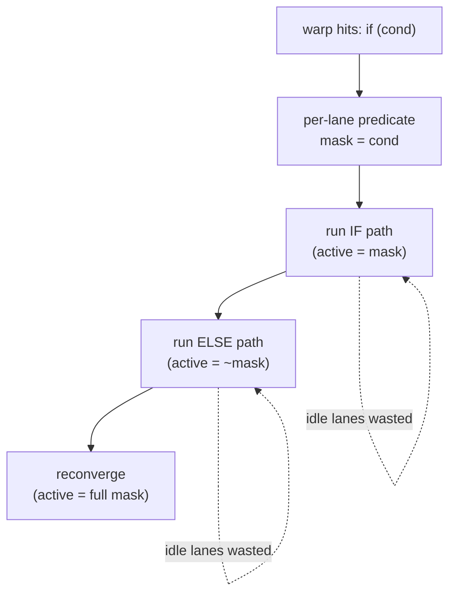

# 05 — Branch Divergence

> **Goal:** understand why a single `if` statement can halve a warp's throughput — the
> effect that fundamentally shapes *what GPUs are good at*. This is also the effect that,
> measured in an earlier phase of this project, shut down a whole design (the spike NO-GO).
>
> **Status:** the theory here is complete, and the instructions that make it *measurable*
> (`slt`/`bra`/`jmp` + a per-warp reconvergence stack) are now **built** — this chapter
> both teaches divergence and documents the implemented slice. The mechanism (the active
> mask) came from chapter 02; §5 shows the working code and the measured cost.

---

## 1. The problem: one instruction stream, threads that want to disagree

A warp has **one program counter** for all 32 lanes (chapter 02). That's fine when every
lane wants to do the same thing. But real code has branches:

```c
if (x[i] > 0)
    y[i] = expensive_A();   // some threads want this
else
    y[i] = expensive_B();   // other threads want that
```

Within one warp, some lanes have `x[i] > 0` and some don't. They want to execute **different
instructions** — but the warp has only *one* PC. It physically cannot run two instructions
at once. What does the hardware do?

---

## 2. Intuition: the tour group with one guide

A tour guide leads 32 people through a building with one PA system — everyone hears the same
instruction. At a fork, 20 people want the left wing, 12 want the right. The guide can't
split. So they say: *"Right-wing group, wait here. Left-wing group, follow me"* — walks the
left wing with 20 people (12 idle), comes back, then *"Left group wait, right group follow"*
and walks the right wing with 12 (20 idle).

**Both wings get walked, one after the other.** The total time is left + right, even though
each *person* only needed one wing. That serialization is **branch divergence.**

```
   No divergence (warp agrees):        Divergence (warp splits on an if):
   all 32 lanes take the same path     ┌───────────── time ─────────────▶
   ▓▓▓▓▓▓▓▓▓▓▓▓▓▓▓▓ path                if-branch:  ▓▓▓▓▓▓░░░░░░  (mask A active)
   → full throughput                    else-branch:░░░░░░▓▓▓▓▓▓  (mask B active)
                                        reconverge: ▓▓▓▓▓▓▓▓▓▓▓▓
                                        → BOTH paths run in series; idle lanes wasted
```

In the worst case (every lane a different path, or a loop where threads iterate different
counts), a 32-lane warp can degrade toward **1/32 of peak** — it's running one useful lane
at a time.

---

## 3. The mechanism: masked serial execution and reconvergence

The hardware handles divergence with the **active mask** you met in chapter 02:

1. At the branch, evaluate the condition per lane → a predicate bit per lane.
2. **Execute the `if` path** with the active mask = lanes whose predicate is true (others
   masked off, idle).
3. **Execute the `else` path** with the mask inverted.
4. **Reconverge** at the point after the branch: restore the full mask, continue together.

The two paths are executed **sequentially**, not in parallel. The cost of a divergent branch
is therefore ≈ `cost(if-path) + cost(else-path)`, versus `max(...)` if there were no
divergence. Managing this needs a small **reconvergence stack** (the classic technique:
immediate-post-dominator reconvergence) that remembers where the masked-off lanes should
rejoin.



---

## 4. Why this shapes what GPUs are good at

Divergence is the deep reason for the workload split we keep returning to:

- **GPUs love regular, uniform control flow** — dense linear algebra, convolutions, neural
  nets. Every thread does the same arithmetic; warps never split; lanes stay busy.
- **GPUs struggle with irregular, data-dependent control flow** — traversing trees/graphs,
  branchy parsing, recursive descent. Threads disagree constantly; warps serialize; the
  ALU array runs half-empty.

> **This is not hypothetical — this project measured it.** Grove began as an attempt to beat
> a GPU at **decision-tree ensemble inference** (XGBoost), betting that its heavy,
> data-dependent branching was a weakness a different architecture could exploit. A $0
> cost-model spike tested that bet and returned **NO-GO**: even so, a well-built branchless
> CPU baseline already neutralizes the branching, and the win wasn't there
> (`../../spike/out/conclusion.md`, decision D-014). Divergence is the villain those
> tree workloads fight — and understanding it here is understanding *why* that whole design
> question mattered.

---

## 5. In our mini-GPU: how divergence is built

**The substrate (chapter 02):** every `Warp` carries `std::array<bool, WARP_SIZE> active`,
and every instruction respects it (`if (w.active[l]) ...`). Divergence builds on that mask.

**The instructions (in `include/simt/isa.hpp`):**

- **`slt rd, ra, rb`** — set-less-than: `rd = (ra < rb) ? 1 : 0`. This produces the per-lane
  **predicate** (our "set predicate"). ALU, 1 cycle.
- **`bra rp, else, join`** — the divergent branch. Lanes where `rp != 0` fall through to the
  "then" block; lanes where `rp == 0` jump to the `else` label; both paths reconverge at
  `join`. (Encoding: `ra` = predicate reg, `imm` = else-target, `rd` = join-target.)
- **`jmp target`** — unconditional jump, used to skip the else-block at the end of the then-
  block. Labels (e.g. `else:`, `join:`) are resolved by the assembler.

**The reconvergence stack (`src/core.cpp`, `Core::branch` + the pop loop in `Core::run`):**
this is the classic PDOM technique (Fung et al.). When `bra` finds the warp's active lanes
**disagree**, it splits:

```cpp
// divergent: push the JOIN frame (full mask resumes at join_pc) and the ELSE path,
// then make the live frame the THEN path. Each path pops when its pc reaches join_pc.
Frame join_frame{w.active, join_pc, w.rpc};
Frame else_frame{not_taken, else_pc, join_pc};
w.stack.push_back(join_frame);
w.stack.push_back(else_frame);
w.active = taken;  w.pc = then_pc;  w.rpc = join_pc;
stats_.divergent_branches += 1;
```

The then-path runs (other lanes masked off), reaches `join` via `jmp`, and pops → the
else-path runs, reaches `join`, pops → the join frame restores the **full mask** and the
warp continues in lockstep. The paths ran **serially** — that's the cost. Crucially, if the
whole warp *agrees* (the uniform case), `bra` just redirects the PC with **no push and no
cost** — real hardware doesn't pay for a branch the whole warp takes together.

## 6. Measure it yourself — see divergence cost as a number

The kernel `kernels/divergence.sasm` computes `if (tid < 16) C[tid]=100+tid else 200+tid`.
Run it (one warp, so `tid < 16` **splits** the warp):

```
build\simt.exe kernels\divergence.sasm 32
→ cycles: 426   mem ops: 2   divergences: 1   C[0..7]: 100 101 ... 107
```

`mem ops: 2` is the smoking gun: the store executed **twice** — once for the then-lanes,
once for the else-lanes, in series — even though each lane stores once. The test
`test_divergence` (in `tests/test_simt.cpp`) makes the cost explicit by comparing against a
**uniform** version (threshold 64 → all lanes take the then-path, no split): the divergent
warp runs strictly more instructions and cycles (`cd.cycles > cu.cycles`), while both produce
correct results. That gap *is* the divergence penalty, measured.

> **Try it:** change the threshold in `divergence.sasm` to 32 (all lanes `tid < 32` → the
> warp agrees). Watch `divergences` drop to 0 and the cycle count roughly halve — you just
> made a branch free by removing divergence, exactly as a GPU programmer would.

---

## 7. On real GPUs

- Pre-Volta NVIDIA GPUs used exactly this: one PC per warp + a reconvergence stack, with
  reconvergence at the immediate post-dominator of the branch.
- **Volta (2017) independent thread scheduling** gave each thread its own PC, allowing
  diverged lanes to interleave and make progress independently (helpful for fine-grained
  synchronization and some divergent patterns). It reduces some pathologies but does **not**
  make divergence free — divergent lanes still can't execute different instructions in the
  same cycle on shared SIMD units.
- Programmers minimize divergence by structuring data so a warp's threads agree (e.g. sort
  by branch outcome, or align branch granularity to the warp).

> **Reality check.** Our model uses simple if/else reconvergence and ignores Volta-style
> per-thread PCs. That's the correct first mental model and matches classic GPU behavior;
> the refinement is noted for honesty.

---

## Check your understanding
1. A warp hits an `if/else` where 20 lanes take `if` and 12 take `else`. Roughly how does the
   cost compare to a version where all 32 agree? Why?
2. Which piece of divergence machinery is *already* in our simulator, and which pieces does
   the next slice add?
3. Connect divergence to the Grove spike's NO-GO result: why were decision trees a tempting —
   but ultimately losing — target?

---

## References
- W. W. L. Fung, I. Sham, G. Yuan, T. M. Aamodt, "Dynamic Warp Formation and Scheduling for
  Efficient GPU Control Flow," *MICRO*, 2007 (divergence and reconvergence — foundational).
- NVIDIA, *Volta V100 Whitepaper*, 2017 (independent thread scheduling).
- NVIDIA, *CUDA C++ Programming Guide* — "Branch Divergence" / "Control Flow."
- Grove project: `../../spike/out/conclusion.md` and `../../decisions.md` (D-006, D-014) —
  the measured tree-inference NO-GO.

→ Previous: [04 — Memory Coalescing](04-memory-coalescing.md) · Next: [06 — Cycle-Accurate Simulation](06-cycle-accurate-simulation.md)
