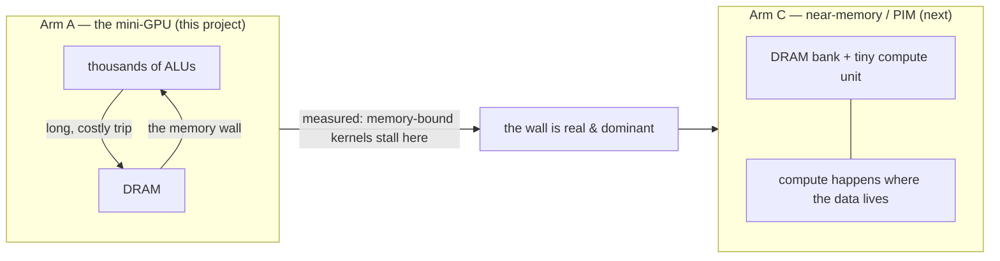

# 09 — The Memory Wall, Measured (and the Bridge to Arm C)

> **Goal:** put the whole course together to *measure* the memory wall on our own machine —
> the bottleneck chapter 01 promised — and see precisely why it motivates the next project,
> **Arm C (near-memory / PIM)**. This is the capstone of Arm A: everything we built (SIMT,
> latency hiding, coalescing, divergence, reduction) exists to fight this wall.

---

## 1. Recap: the wall, in one sentence

Arithmetic is cheap; moving data is expensive (chapter 01). A processor is only fast if it can
**keep its arithmetic units fed** despite slow memory. We've built the exact machinery GPUs use
to try: many warps to hide latency (ch. 03), coalescing to minimize transactions (ch. 04). Now
let's measure what happens when a kernel is dominated by memory anyway.

---

## 2. Measurement 1 — one memory access ≈ 200 arithmetic ops (the *latency* wall)

Run the arithmetic-intensity sweep (`analysis/sweep.py` → `memory_wall.png`): a kernel that
loads one word, does **K** arithmetic ops, and stores it — single warp, so memory latency is
fully exposed. The measured cycles:

```
   K (arith ops):   0     25    50    100   200   400
   cycles:          451   476   501   551   651   851
                    └──────────  cycles = 451 + K  ──────────┘
```

A dead-straight line, `cycles = 451 + K`, and the story is in the two parts:

- **The intercept, 451 cycles, is pure memory** — just the two accesses (load + store), with
  essentially no compute. That's the floor you pay no matter how little arithmetic you do.
- **The slope is 1** — each arithmetic op adds one cycle.

So in the time of **two** memory accesses you could have done ~**451 arithmetic ops** — roughly
**225 arithmetic operations per memory access**. Flip that around: *unless your kernel does
hundreds of arithmetic ops per value it loads, its runtime is dominated by memory, not
compute.* That shaded region (`K` below the floor) is the wall — you're waiting, not computing.

> This is the **arithmetic intensity** idea (compute per byte moved) and the **roofline
> model** (ch. 04) made concrete: low intensity → memory-bound (left of the knee); high
> intensity → compute-bound (right). Most real kernels — and *especially* memory-heavy ones
> like embedding lookups, sparse ops, and graph traversal — live on the memory-bound side.

---

## 3. Measurement 2 — a maximally memory-bound kernel (the *bandwidth* wall)

Now the other face of the wall. Run the pure data-movement kernel — a scattered gather that
reads a word and writes it straight back, with no useful compute (`kernels/memory_bound.sasm`):

```
build\simt.exe kernels\memory_bound.sasm 32
→ warp-instrs: 6    mem txns: 64    cycles: 900
```

Look at that ratio: **6 instructions, 900 cycles.** The machine executed almost no work yet
took 900 cycles — because the two memory instructions are **scattered** (stride 8 → every lane
in its own segment → 32 transactions each, 64 total; ch. 04). Nearly 100% of the time is data
movement, and most of it is *wasted bandwidth* — the access pattern is uncoalesced.

This is the workload profile of some of the most important programs in computing:
recommendation-model **embedding gathers**, **sparse matrix-vector** products, graph analytics.
They move enormous amounts of data and compute almost nothing per byte. On such kernels a GPU's
thousands of ALUs sit idle; the machine is a very expensive memory-copy engine.

---

## 4. Why the wall is the plot, not a footnote

Step back and see what the two measurements say together:

```
   compute is cheap ........ ~1 cycle / arithmetic op
   memory is dear .......... ~225 cycles / access (latency), and
                             uncoalesced access multiplies the transactions (bandwidth)
   ⇒ memory-bound kernels are limited by DATA MOVEMENT, and no amount of extra
     arithmetic throughput (more ALUs, more warps) helps them.
```

Every GPU technique we built is an attempt to *tolerate* the wall — hide the latency, minimize
the transactions. But none of them **remove** the fundamental cost: the data still has to make
the long, energy-expensive trip between memory and the compute units. For a memory-bound
kernel, that trip *is* the program.

> **Reality check (honest scope).** Our single-issue model exposes the **latency** face of the
> wall crisply (measurement 1) and counts **transactions/bytes** for the **bandwidth** face
> (measurement 2). It does *not* yet model a hard cross-warp memory-bandwidth ceiling (a
> bandwidth-capped memory system) — with many warps our model hides latency but won't saturate
> a bandwidth roof. Adding that cap is a natural refinement, and modeling data movement
> faithfully is exactly what Arm C needs. So this chapter *motivates* Arm C rather than fully
> quantifying its win.

---

## 5. The bridge to Arm C: stop moving the data

If the problem is the expensive trip between memory and compute, there are only two moves:

1. **Move the data less** — caching, coalescing, reuse. That's what GPUs do; it *tolerates* the
   wall but can't beat a kernel with no reuse (like a one-shot gather).
2. **Move the compute to the data** — put small arithmetic units *inside or beside* the memory
   banks, so the data barely moves at all. This is **Processing-In-Memory (PIM) / near-memory
   computing**, and it's the premise of **Arm C**.



**What Arm C will build and measure.** A near-memory architecture with its own small ISA, run on
a memory-bound kernel (embedding gather / SpMV — the profile from measurement 2), with the
headline metric being **off-chip bytes moved** (and modelled data-movement energy) versus the
Arm-A baseline this course produced. If PIM cuts the bytes moved, that's a *use-case-driven*,
measurable win — the "solve" to Arm A's "expose" (project decisions D-011, D-015).

This is why Arm A had to come first: you cannot credibly claim to *solve* the memory wall until
you've *built the standard machine and measured that it stalls on it.* You just did.

---

## Check your understanding
1. From `cycles = 451 + K`, roughly how many arithmetic ops equal the cost of one memory
   access, and what does that imply for a kernel that loads a value and adds 10 to it?
2. The memory-bound kernel ran 6 instructions in 900 cycles. Where did the time go, and which
   chapter's mechanism explains the 64 transactions?
3. GPUs *tolerate* the memory wall; PIM aims to *remove* a big part of it. What's the essential
   difference in strategy, and why does a one-shot gather defeat the GPU's approach?

---

## References
- S. Williams, A. Waterman, D. Patterson, "Roofline: An Insightful Visual Performance Model,"
  *Communications of the ACM*, 2009.
- Wm. A. Wulf & S. A. McKee, "Hitting the Memory Wall," 1995.
- S. Ghose et al., "Processing-in-Memory: A Workload-Driven Perspective," *IBM J. R&D*, 2019.
- UPMEM, Samsung HBM-PIM (real near-memory systems) — background for Arm C.
- Lithos project: `../../decisions.md` (D-011 parked PIM idea, D-015 the A→C arc),
  `../../handoff.md`.

→ Previous: [08 — Reduction & Cross-Thread Communication](08-reduction-and-communication.md) · Back to [index](README.md)
